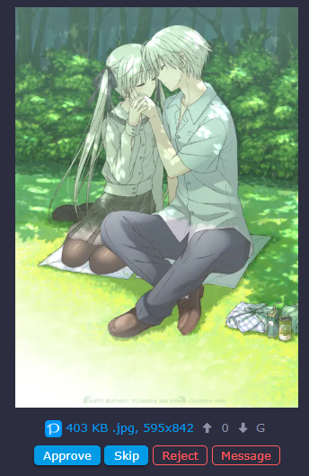
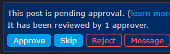
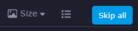
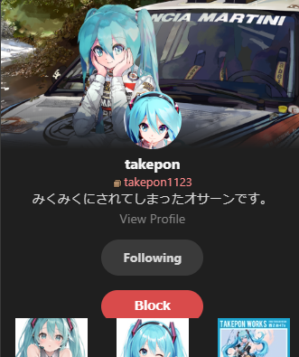
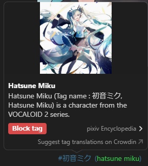
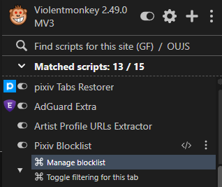
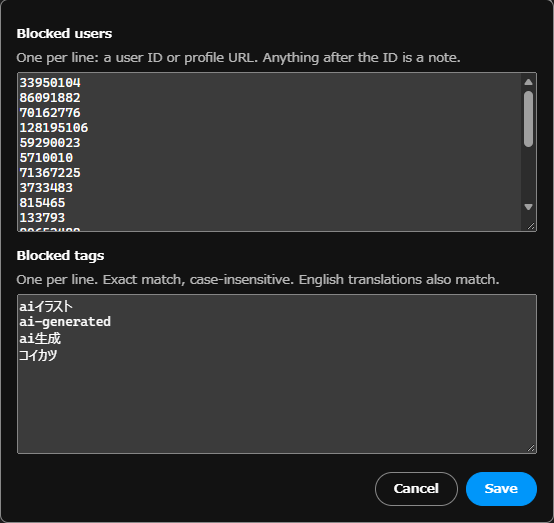

# Danbooru-Userscripts
Userscripts I've made for Danbooru.

## Installation

- Install [Violentmonkey](https://violentmonkey.github.io) _or_ [Tampermonkey](https://tampermonkey.net/) browser extension.
- Download the script.
- An installation prompt will appear. Accept the installation.

## Scripts

### Quick detailed rejection

Adds button in the modqueue to quickly add a detailed rejection message to a post. Also works on the post page itself.

[Install](https://raw.githubusercontent.com/HyphenSam/Danbooru-Userscripts/master/quick_detailed_rejection.user.js)

Screenshots

### Skip All (Modqueue) (Modified)

A modified version of iodoff's userscript that skips all current posts in the modqueue. This version now works properly on pages with a large amount of posts by adding a delay between each skip.

[Install](https://raw.githubusercontent.com/HyphenSam/Danbooru-Userscripts/master/skip_all_modqueue_modified.user.js)

### AI Check (Modified)

A modified version of waterflame's [userscript](https://danbooru.donmai.us/forum_posts/328734) that checks an artist's existing posts on the upload page. Shows red if any post is tagged `ai-generated`, orange or yellow depending on how many posts are deleted, and green otherwise.

[Install](https://raw.githubusercontent.com/HyphenSam/Danbooru-Userscripts/master/ai-check.user.js)

### Pixiv Blocklist

Hides Pixiv artworks from blocked users or with blocked tags. Adds a "Block" button next to Follow buttons and a "Block tag" button to tag popups. Manage the blocklist or toggle filtering for the current tab from the userscript menu.

[Install](https://raw.githubusercontent.com/HyphenSam/Danbooru-Userscripts/master/pixiv-blocklist.user.js)

Screenshots

### Booru Tag Parser

A refactor of JetBoom's [boorutagparser](https://github.com/JetBoom/boorutagparser/). Copies the current post's tags and rating to the clipboard on most boorus and nhentai, ready to import into Hydrus or another booru. Copy tags from the userscript menu or with a shortcut (`]` by default). Change the shortcut and other options from the userscript menu.

[Install](https://raw.githubusercontent.com/HyphenSam/Danbooru-Userscripts/master/booru-tag-parser.user.js)